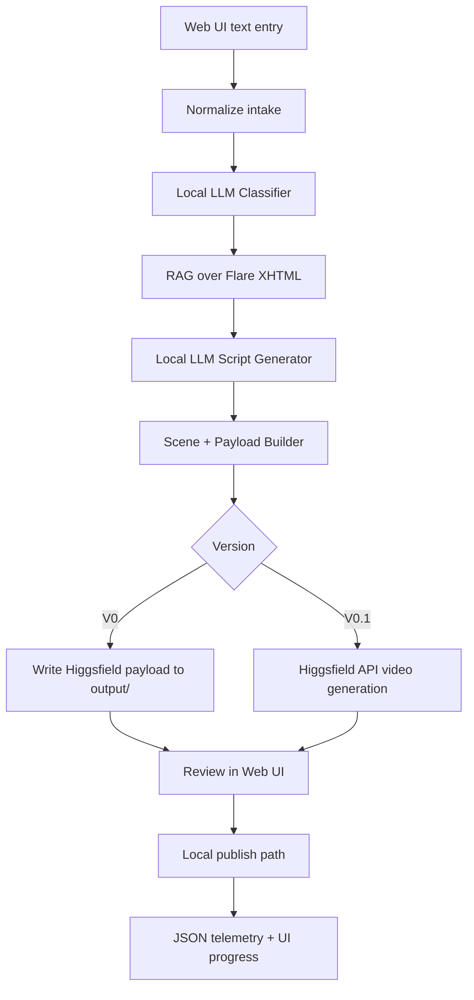

# Gamma Presentation Brief — AI-Generated Support Videos

## Generation guidance

Create a polished 10-slide client presentation for business, support, and content-leadership stakeholders at an enterprise accounting software company.

- Tone: credible, practical, forward-looking, and outcome-focused.
- Visual style: modern enterprise technology; clean layouts; restrained blue, white, and charcoal palette; subtle accounting-software UI motifs.
- Avoid: futuristic robots, excessive AI imagery, unsupported ROI claims, and dense technical diagrams.
- Use short headlines and minimal body copy. Turn supporting details into diagrams, process graphics, and metric cards.
- Clearly distinguish the local-first prototype from the future production vision.
- Refer to the product as **SI VidGen** where a product name is useful.

---

## Slide 1 — AI-Generated Support Videos for Accounting Software

### Subtitle
Turn trusted help content and real user issues into clear, reviewable video guidance.

### Supporting line
Reducing the effort required to create support videos while improving speed, consistency, and customer experience.

### Visual direction
Show a simple transformation: support question + trusted help article → polished instructional video. Use a clean accounting-software interface motif, not a generic AI robot.

### Speaker note
Support teams already know which questions customers repeatedly ask, and content teams already maintain the approved answers. The opportunity is to connect those assets through a governed AI workflow that produces useful video guidance in minutes rather than through a fully manual production cycle.

---

## Slide 2 — The Support Content Gap

### Headline
Customers need visual guidance, but traditional video production cannot keep pace.

### Key points
- Complex accounting workflows are difficult to explain through text alone.
- The same navigation, configuration, and error-resolution questions recur across support channels.
- Valuable Help Center content is often underused when customers cannot quickly find or apply it.
- Manual scripting, recording, editing, captioning, and publishing make video expensive to create and update.
- Frequent product and documentation releases create an ongoing content-maintenance burden.

### Closing statement
The result: customers wait longer, support teams repeat known answers, and high-value documentation does not reach its full potential.

### Visual direction
Use a four-part problem graphic: complex workflows, repeated tickets, underused help content, and slow video production. Connect them to a central “support content gap.”

### Speaker note
This is not primarily a shortage of knowledge. The approved knowledge already exists. The constraint is converting it into a format that is easy for customers to consume and practical for content teams to maintain.

---

## Slide 3 — The Opportunity: Reuse Trusted Knowledge at Video Speed

### Headline
AI can transform existing support knowledge into a scalable video-production system.

### Key points
- Start with authorized, published Intacct Help Center content as the source of truth.
- Match a user issue to the most relevant procedures through retrieval-augmented generation.
- Generate structured narration and scene instructions with a local language model.
- Convert approved scripts and scenes into Higgsfield-ready video requests.
- Keep information developers and project managers in control through review and approval.

### Value statement
Create more support videos, respond to emerging issues faster, and maintain consistent messaging—without replacing editorial governance.

### Visual direction
Show a flywheel: trusted documentation → user need → AI-assisted draft → human approval → video → engagement insights → content priorities.

### Speaker note
The differentiator is grounded generation. The system does not ask a model to invent a support answer. It retrieves approved content first, then uses AI to adapt that content into a structured instructional format.

---

## Slide 4 — The Solution: A Governed Content-to-Video Pipeline

### Headline
From a support issue to a reviewable video package in one guided workflow.

### Pipeline
1. **Capture** — An operator enters a representative user issue in a browser-based interface.
2. **Understand** — A local Ollama model classifies the feature area, intent, and likely error type.
3. **Ground** — RAG retrieves relevant content from authorized Flare XHTML Help Center output.
4. **Author** — AI generates narration, actions, and a scene plan grounded in the retrieved source.
5. **Package or render** — V0 exports a validated Higgsfield payload; V0.1 submits it to Higgsfield for video generation.
6. **Review and approve** — Information developers or project managers inspect the script, scenes, sources, and output.
7. **Publish locally and measure** — Approved artifacts are stored locally with privacy-safe run telemetry.

### Guardrails
- Local LLM processing for the prototype
- Existing Help Center assets preferred
- No invented product screenshots
- No full issue text or retrieved help chunks retained in telemetry
- API secrets stored outside source control

### Visual direction
Use a horizontal seven-step pipeline with a visible human approval gate between generation and publication.

### Speaker note
The prototype intentionally begins with operator-entered issues and local publishing. MCP, structured-file intake, and production publishing are integration points for later phases once output quality and workflow value are proven.

---

## Slide 5 — Architecture: Local-First, Modular, and Deployment-Ready

### Headline
A modular prototype validates the workflow without requiring production-system changes.

### Technology callouts
- **Operator experience:** React + Vite web UI
- **Application layer:** FastAPI + Python 3.11
- **Local AI:** Ollama with `gemma3:12b`; lightweight fallback available
- **Knowledge retrieval:** Flare XHTML → local embeddings → Chroma
- **Future portability:** Pinecone-ready vector-store interface
- **Video:** Higgsfield payload export in V0; live API generation in V0.1
- **Operations:** Structured JSON telemetry, progress feedback, tests, and GitHub Actions path

### Visual direction
Render the Mermaid flow as a clean architecture diagram. Visually group intake, understanding, knowledge, authoring, rendering, review, and telemetry. Highlight the human review gate.

### Speaker note
Each provider sits behind a defined module, reducing lock-in. The prototype runs on local RTX 4070-class hardware with models up to approximately 12B parameters. The design can later move model inference, vector storage, and application hosting to managed services without rewriting the full workflow.

---

## Slide 6 — Prototype Demo: One Issue, One Traceable Video Package

### Headline
Demonstrate the complete path using a real accounting support scenario.

### Example issue
“I’m getting an unbalanced journal entry error when I try to post in General Ledger.”

### Demo flow
1. Enter the issue in the SI VidGen web interface.
2. Watch live progress as the system classifies it as a General Ledger posting issue.
3. Review the retrieved Intacct Help Center source and recommended resolution steps.
4. Inspect the generated title, narration, and scene-by-scene plan.
5. Export the validated Higgsfield JSON payload in V0.
6. In V0.1, submit the same approved payload and retrieve the video, thumbnail, and captions.
7. Approve or reject the package and store approved artifacts in the local publish path.

### What the demo proves
- The answer is grounded in authorized support content.
- The workflow is traceable from issue to source to script to output.
- Human reviewers remain accountable for the final result.
- The video-provider integration is separated from content logic.

### Visual direction
Use a storyboard with four large frames: issue, source-backed script, Higgsfield payload/video, and reviewer approval. Add a small provenance line connecting each frame.

### Speaker note
V0 proves the most important technical contract: the system can reliably turn an issue and trusted source content into a structured, reviewable Higgsfield request. V0.1 adds the live rendering step without changing the upstream workflow.

---

## Slide 7 — Business Value Across the Support Ecosystem

### Headline
One workflow creates value for customers, support teams, and content operations.

### Customer value
- Faster access to task-based, visual guidance
- Clearer explanations of complex accounting workflows
- Consistent captions and repeatable instructions
- Better self-service experience at any time

### Support value
- More opportunities to deflect repetitive “how-to” contacts
- Reusable video responses for common issues
- Faster escalation from emerging issue pattern to support asset
- More agent time available for complex cases

### Content-team value
- Less manual effort across scripting, storyboarding, and provider handoff
- Consistent terminology and brand treatment
- Easier refreshes when Help Center content changes
- Reviewable outputs with source traceability and audit history

### Visual direction
Use three columns—customers, support, content operations—with a shared center label: “faster, governed support content.”

### Speaker note
The goal is not fully autonomous publishing in the prototype. The value comes from automating the repetitive production steps while preserving the review standards required for financial software guidance.

---

## Slide 8 — Measuring Impact from Baseline to Pilot

### Headline
Success will be measured through workflow efficiency, content quality, and customer outcomes.

### Prototype measures
- **Pipeline completion rate:** issues that produce a valid, reviewable payload
- **Grounding quality:** retrieved sources judged relevant by reviewers
- **First-pass approval rate:** outputs approved without material rewrite
- **Production cycle time:** issue intake to approved video package
- **Reliability:** stage success rate, processing time, and recoverable errors

### Pilot business measures
- **Ticket deflection:** reduction in contacts for video-covered topics
- **Time to resolution:** change in handling or customer resolution time
- **Video engagement:** starts, completion rate, and drop-off points
- **Self-service success:** users who resolve the issue without opening a ticket
- **Onboarding effectiveness:** completion and support-contact rates for guided workflows
- **Content reuse:** number of videos created or refreshed per source topic

### Measurement approach
Establish a baseline first, run a controlled pilot on a small set of high-volume issues, and compare results by topic and release period. Set numeric targets only after baseline data is available.

### Visual direction
Create two rows of metric cards: “Prototype validation” and “Pilot business impact.” Include a simple baseline → pilot → scale progression.

### Speaker note
This avoids speculative ROI. The prototype establishes technical and editorial feasibility; a focused pilot then quantifies ticket, engagement, and production-efficiency impact using the client’s actual baseline.

---

## Slide 9 — Roadmap: Prove, Connect, Personalize, Scale

### Headline
Advance in controlled stages, with quality and governance gates at each step.

### Phase 1 — Core pipeline: prototype
- Browser-based text intake
- Local classification and RAG over authorized Flare XHTML
- Script and scene generation
- V0 Higgsfield payload export
- Review workflow, local output, telemetry, and comprehensive tests

### Phase 2 — Render and connect
- V0.1 live Higgsfield video generation
- MCP and structured issue-file connectors
- Help Center, portal, or LMS publishing adapters
- Content-change detection for Friday minors and quarterly releases

### Phase 3 — Expand reach
- Multi-language scripts, narration, captions, and review workflows
- Reusable templates by module, task type, and audience
- Production analytics and content-gap recommendations

### Phase 4 — Personalize and automate
- Role-, workflow-, and context-aware video variants
- Managed cloud inference and vector storage
- Policy-based auto-generation for approved use cases
- Human approval thresholds based on confidence and risk

### Visual direction
Use a four-stage maturity curve. Mark the current prototype boundary after Phase 1 and the live Higgsfield demo milestone at the start of Phase 2.

### Speaker note
The roadmap deliberately separates content intelligence from production integrations. Each phase delivers usable value while creating evidence for the next investment decision.

---

## Slide 10 — Recommended Next Step: Validate with a Focused Prototype

### Headline
Prove the workflow on real support content and a small set of high-value issues.

### Proposed prototype outcome
An end-to-end, local-first demonstration that converts representative Intacct support issues into grounded scripts, scene plans, and valid Higgsfield payloads—with an optional live video-generation step.

### Client inputs needed
- Confirm access to the authorized Flare XHTML Help Center output
- Select 5–10 recurring, high-value support scenarios for evaluation
- Identify information developers and project managers for review
- Provide approved brand guidance and existing reusable visual assets
- Obtain Higgsfield API access for the V0.1 rendering demonstration
- Agree on baseline measures and prototype acceptance criteria

### Decision enabled
At the end of the prototype, determine whether to proceed to an integrated pilot based on quality, reviewer effort, reliability, and measurable support opportunity.

### Closing line
**Turn trusted support knowledge into scalable video guidance—without giving up accuracy, control, or editorial governance.**

### Visual direction
End with a clear “Prototype → Evidence → Pilot” path and a single call-to-action button-style element: “Select the first support scenarios.”

### Speaker note
The immediate ask is not a production rollout. It is a focused validation using real content, real support scenarios, and explicit acceptance criteria so the client can make the next decision with evidence.
