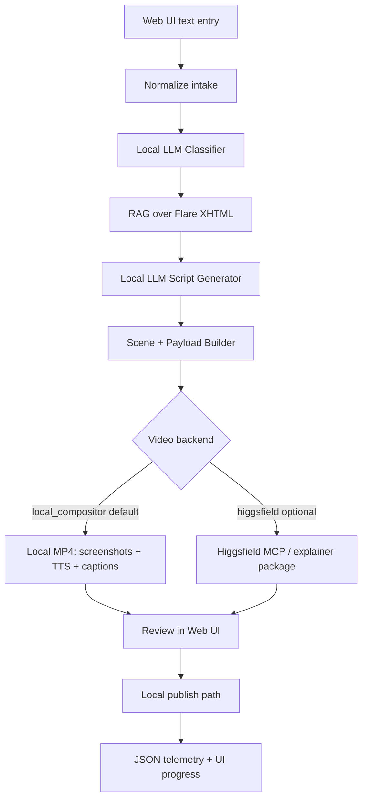
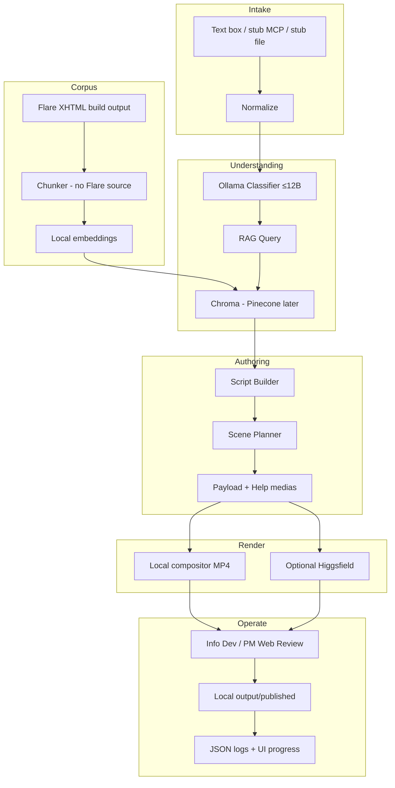

# SI VidGen — AI-Generated Support Video System

Automated support-video creation for **Sage Intacct** help workflows. Prototype runs **locally** (Python venv + Ollama on RTX 4070–class hardware), indexes **authorized Intacct Support content** from Flare **XHTML build output**, and produces **reviewable instructional videos** that preserve Help Center screenshots (local compositor by default; optional Higgsfield cloud path).

---

## Goal

Build a **local-first prototype** that helps **information developers** and **project managers** turn a support/help issue into a reviewable instructional video package:

1. Accept an issue via **web UI text entry** (MCP and structured-file ingest stubbed).
2. Classify the issue with a **local LLM** (Ollama, models ≤ ~12B).
3. Retrieve relevant Intacct help via **RAG** over **Flare XHTML build output** (local embeddings + Chroma).
4. Generate a structured video script and scene plan with a **local LLM**, binding **Help image library** screenshots when available.
5. **V0 (current demo):** Review/approve in the web UI, then render a local MP4 via the **local screenshot compositor** (Ken Burns + neural TTS + burn-in captions) that **preserves Help PNG pixels**.
6. **Optional V0.1:** Export Higgsfield explainer packages and/or call **Higgsfield MCP** when `VIDEO_BACKEND=higgsfield` (generative restyle is secondary—Help screenshots are authoritative).
7. Emit **structured JSON telemetry**, maintain **development status**, and ship with **comprehensive tests** and **thorough documentation**.
8. Leave the repo **fully prepped for GitHub** (and desirable **GitHub Actions + Vercel** CI/CD) as an exit criterion for the prototype phase.

**Non-goals for V0:** production multi-tenant SaaS, end-customer portals, real help-center/LMS publishing, cloud LLM inference, Flare topic-source (`.fl*` / MadCap) ingestion, inventing screenshots not already in the Intacct Help Center.

---

## Project constraints (confirmed)

| Constraint | Decision |
|---|---|
| Runtime | Local machine, Python **3.11+** **venv** |
| Hardware | RTX 4070–class; local chat models **up to ~12B** |
| LLM | **Ollama** (already installed); `gemma3:12b` primary, `llama3.2:latest` lightweight fallback |
| Help corpus | Authorized Intacct Support content; ingest **Flare XHTML build output** (not Flare source) |
| Help cadence | **Quarterly** major revisions; **Friday** minor updates |
| Vector store | **Chroma** (prototype) → **Pinecone** (eventual deployment) |
| Video V0 | **Local compositor** MP4 under `output/videos/` (default; Help screenshots preserved) |
| Video V0.1 | Optional **Higgsfield** MCP/API generation (`VIDEO_BACKEND=higgsfield`) |
| UI | **Web-based**, browser-agnostic |
| Intake | Text box in UI; **MCP** + structured file ingest **stubbed** |
| Publish V0 / V0.1 | Write target files to **local path** (`output/`) |
| Secrets | API keys in `.env` (never committed); team obtains access |
| Source control | **GitHub**; prototype exit requires repo fully prepped |
| Deploy (desired) | **GitHub Actions + Vercel** CI/CD |
| Primary users | Information developers and project managers |
| Visuals | Prefer / reuse assets **already in Intacct Help Center**; do not depend on unavailable screenshots |
| Quality bar | Thorough docs, living status, comprehensive testing, structured telemetry + UI progress |

---

## Confirmed decisions (D1–D12)

### D1 — Corpus / Flare
**Confirmed.** Team is authorized to use Intacct Support content. Authoring source lives in **MadCap Flare**; Flare source markup is disruptive to chunking. Crawl the published XHTML build starting at `https://www.intacct.com/ia/docs/en_US/help_action/Intacct_basics/welcome.htm`, restricted to the same host and `/ia/docs/en_US/help_action/` path. Plan incremental re-index hooks for quarterly majors and Friday minors.

### D2 — Local LLM
**Confirmed.** Ollama is installed on the build machine. Installed manifests:

- `gemma3:12b` (8.1 GB) — **primary** classifier/script-generation model
- `llama3.2:latest` (2.0 GB) — lightweight fallback and faster development model
- `dolphin-mixtral:8x7b` (26 GB) — installed but excluded from prototype defaults because it exceeds the preferred local model envelope

`nomic-embed-text` is installed and configured for local embeddings. All model calls go through `src/llm/client.py`.

### D3 — Vector store
**Confirmed.** **Chroma** locally for the prototype. Design a thin `VectorStore` interface so **Pinecone** can replace it for eventual deployment without rewriting RAG callers.

### D4 — Video backends
**Confirmed.**
- **V0 / English demo (default):** `VIDEO_BACKEND=local_compositor` — Ken Burns over Help screenshots, Edge neural TTS, optional burn-in captions, voice/pace controls in the review UI. Writes MP4 under `output/videos/`.
- **Optional cloud path:** `VIDEO_BACKEND=higgsfield` — explainer package export + MCP generation. Generative models may invent UI text; prefer the local compositor when Help screenshots must stay authoritative.
Payload builder, local compositor, and Higgsfield client are separate modules behind `create_video_generator()`.

### D5 — Operator interface
**Confirmed.** **React + Vite** is the browser-agnostic operator UI; **FastAPI** is the backend API. CLI may exist for smoke/dev tests but is not the operator product.

### D6 — Intake
**Confirmed.** Prototype UI has a **text entry box**. Stubs for: **MCP connection** and **structured file ingest** of user feedback/issues. Wire real connectors after the core pipeline is stable.

### D7 — Publishing
**Confirmed.** V0 and V0.1 write artifacts to a **local output path**. No live help-center/LMS upload in prototype.

### D8 — Python / packaging
**Confirmed.** Python **3.11+**, venv, `requirements.txt` + `requirements-dev.txt`.

### D9 — Telemetry
**Confirmed.** **Structured JSON** run/stage logs on disk, plus live in-UI feedback while processing. Persist metadata, IDs, hashes, timings, model names, stage outcomes, and errors—but **never full issue text or retrieved help chunks**.

### D10 — Testing & GitHub exit
**Confirmed.** Unit / contract / integration / e2e with local mocks. **Directory fully prepped for initial GitHub check-in** is required to exit the prototype phase (`.gitignore`, README, status, tests, CI stubs as appropriate).

### D11 — Screenshots / visuals
**Confirmed.** **Avoid reliance on screenshots that are not already available from the Intacct Help Center.** Scene visuals should reference help-center assets or describe UI elements textually when no asset exists—never invent or require missing product captures. V0.1 harvests a local Help image library (`data/help_assets/`) and attaches usable screenshots to the Higgsfield `video_explainer` medias package. See `docs/image_library.md`.

### D12 — Repo & CI/CD
**Confirmed as highly desirable.** GitHub repository with GitHub Actions checks. Treat Vercel as a **future full cloud deployment** after the API, model inference, and corpus/vector storage have hosted replacements; do not create a split Vercel-UI/local-backend production architecture. Exact org/repo name TBD at first push.

---

## System architecture



Detailed stage flow:



---

## Repository structure (target)

```text
/
  README.md                 # this file
  DEVELOPMENT_STATUS.md     # living status of phases/tasks
  tasks.md                  # implementation task list
  scaffold.md               # module stub reference
  pyproject.toml            # optional package metadata
  requirements.txt
  requirements-dev.txt
  .env.example
  .gitignore
  /src
    /intake                 # text + stub MCP + stub file ingest
    /classifier
    /rag                    # xhtml ingest, chunker, chroma (+ pinecone-ready iface)
    /scriptgen
    /video                  # payload builder; local compositor; Higgsfield client
    /publish
    /analytics
    /telemetry              # JSON logs + run store; UI event stream
    /llm
    /api                    # FastAPI + static/web UI
    orchestrator.py
  /config
  /data
    /help_xhtml             # optional local crawl cache (gitignored)
    /help_assets            # Help image library catalog + files (gitignored)
    /compositor_jobs        # local render work (gitignored)
    /help_fixtures          # small committed samples for CI
    /samples
    /vector_store
    /runs
  /output
    /scripts                # grounded script versions
    /payloads               # Higgsfield JSON + explainer packages
    /videos                 # generated MP4s (local compositor or Higgsfield)
    /published
  /tests
    /unit
    /integration
    /e2e
  /docs
    architecture.md
    operator_guide.md
    developer_guide.md
    api.md
    telemetry.md
    corpus_flare_xhtml.md
    multilingual.md
    sample_query.md
    image_library.md
  /.github
    /workflows              # CI for GitHub Actions
```

---

## Component overview

### Issue intake
Web UI **text entry** produces a normalized issue object. MCP and structured-file ingest are stubbed interfaces.

```json
{
  "issue_id": "string",
  "user_id": "string",
  "timestamp": "ISO8601",
  "raw_text": "string",
  "context": {
    "module": "GL | AP | AR | CM | etc",
    "screen": "string",
    "error_code": "string"
  }
}
```

### Classification (local LLM)
Ollama chat model (≤ ~12B): feature area, intent, error type, help topics.

### RAG retrieval
- **Source of truth for indexing:** Flare **XHTML build output** (not Flare project source).
- The crawler is same-host/path scoped, polite, conditionally cached, and capped at 10 pages unless `--full` is explicit.
- Chunk with heading/step preservation; strip repeated navigation; retain existing Help Center asset URLs.
- Embed with local `nomic-embed-text`; store in **Chroma** behind a swappable vector-store protocol.
- Content hashes skip unchanged pages. Full runs remove stale indexed pages for quarterly majors and Friday minors.

### Script + scene generation
Local LLM produces narration, actions, visuals. Visual references must prefer **existing Help Center assets**; otherwise textual UI descriptions only.

### Editable script review
The generated script opens in the web UI before any video request is sent.
Operators can edit the title, narration, scene actions, visuals, and voiceover.
Each save creates a new versioned script and rebuilds the corresponding
payload/explainer package. Source IDs and Help assets remain grounding-validated.

Manual review is the default. Before **Approve & generate video**, operators can
set local compositor options (voice, narration pace, burn-in captions). When the
MP4 is ready, the UI shows an inline player plus download. A default-off
**Generate video automatically** toggle skips manual approval when a video
backend is configured. See `docs/sample_query.md` for the CSV-import demo case.

### Local compositor video (default)
`VIDEO_BACKEND=local_compositor` (see `.env.example`):

- Ken Burns motion over real Help library PNGs (no generative restyle)
- Edge neural TTS (`LOCAL_COMPOSITOR_VOICE`, `LOCAL_COMPOSITOR_TTS_RATE`) with local fallbacks
- Optional burn-in captions from scene voiceover (`LOCAL_COMPOSITOR_CAPTIONS`)
- Output: `output/videos/{run_id}.mp4`

### Higgsfield payload + optional generation
Still export schema-oriented payloads under `output/payloads/` plus explainer
packages for MCP/CLI. Optional live generation uses `VIDEO_BACKEND=higgsfield`.
Example payload shape (exact schema evolves with provider docs):

```json
{
  "script": "string",
  "scenes": [
    {
      "action": "string",
      "visual": "string",
      "voiceover": "string"
    }
  ],
  "voice": "professional_support",
  "style": "clean_product_tutorial",
  "brand": {
    "colors": ["#005EB8", "#FFFFFF"],
    "logo_url": "https://company.com/logo.png"
  },
  "captions": true,
  "thumbnail": "auto"
}
```

### Review + local publish
Operators approve/reject in the web UI. V0/V0.1 “publish” copies/writes approved artifacts under `output/published/`.

### Telemetry
- On disk: structured **JSON** stage/run records under `data/runs/`.
- In UI: live progress (stage, status, duration, errors) during processing.

---

## Local setup (prototype)

```powershell
cd f:\SI_VidGen
py -3.11 -m venv .venv
.\.venv\Scripts\Activate.ps1
python -m pip install --upgrade pip
pip install -r requirements-dev.txt
Copy-Item .env.example .env

# Frontend
cd web
npm install
cd ..

# Models already configured for this machine:
# chat primary: gemma3:12b
# chat fallback: llama3.2:latest
# embeddings: nomic-embed-text

# Verify
ruff check .
pytest --cov=src
cd web
npm run lint
npm run build
cd ..

# Run API
python main.py
# In a second terminal: cd web; npm run dev
# Open http://localhost:5173

# Safe development index (10-page cap)
python -m src.rag.index_help
# Explicit full-scope refresh with stale-page cleanup
python -m src.rag.index_help --full
```

Secrets live only in `.env`. Never commit keys or large proprietary XHTML trees unless explicitly approved. If `npm install` fails with `UNABLE_TO_VERIFY_LEAF_SIGNATURE` on a corporate network, export the Windows root store to a PEM and set `NODE_EXTRA_CA_CERTS` (see [`docs/developer_guide.md`](docs/developer_guide.md)).

---

## Development status

Track progress in [`DEVELOPMENT_STATUS.md`](DEVELOPMENT_STATUS.md):

- Current phase
- Completed / in-progress / blocked tasks
- Known gaps
- Test and telemetry coverage summary
- Last updated date

---

## Testing strategy

| Layer | Scope |
|---|---|
| Unit | Chunking (XHTML), payload builders, schema validation |
| Contract | LLM JSON schemas with fake/recorded responses |
| Integration | Fixture XHTML → embeddings → Chroma → retrieval → script → payload |
| E2E | Orchestrator + UI API with fake LLM; assert payload file + run JSON |
| Regression | Friday/quarterly corpus sample diffs must not silently break retrieval |

CI (GitHub Actions): lint + unit + integration without paid APIs. Higgsfield live calls only when secrets present (optional job).

---

## Telemetry requirements

Every pipeline run must emit JSON fields including:

- `run_id`, `issue_id`, stage name, timestamps, `duration_ms`
- Model identifiers for classification and script generation
- Retrieval: top-K, scores, source ids (XHTML paths)
- Outcome: success | failed | rejected_in_review
- Errors with stable error codes (no secrets)

UI must stream or poll equivalent progress for the active run.

---

## Documentation requirements

| Doc | Purpose |
|---|---|
| `README.md` | Overview, constraints, architecture, setup |
| `DEVELOPMENT_STATUS.md` | Living build status |
| `tasks.md` | Ordered implementation work |
| `scaffold.md` | Module stub reference |
| `docs/developer_guide.md` | Contribute, tests, providers |
| `docs/operator_guide.md` | Info developer / PM workflow |
| `docs/api.md` | HTTP contracts |
| `docs/architecture.md` | Deeper design |
| `docs/telemetry.md` | Events, UI progress, privacy |
| `docs/corpus_flare_xhtml.md` | Flare build drop, chunking, re-index cadence |
| `docs/multilingual.md` | EN/FR/DE/ES-ES strategy and Phrase TMS decision |

---

## Build phases (summary)

1. Repo hygiene + GitHub prep + docs/status + telemetry stubs + web UI shell
2. XHTML ingest + chunking + local embeddings + Chroma (Pinecone-ready interface)
3. Local LLM classifier + schema validation
4. RAG retriever + relevance scoring + re-index notes for Fri/quarterly
5. Script generator + scene planner (Help Center–safe visuals) + image library
6. **V0:** Payload/explainer export + **local compositor** demo video
7. Review workflow + video options/player + local publish path + in-UI progress
8. **Optional:** Higgsfield MCP generation; later in-app OAuth + Phrase TMS
9. Comprehensive tests + GitHub Actions (+ Vercel path)
10. Docs freeze; prototype-exit checklist (GitHub-ready)

Detailed tasks: [`tasks.md`](tasks.md). Module stubs: [`scaffold.md`](scaffold.md).

---

## External services

| Service | Prototype need | Notes |
|---|---|---|
| Ollama (local) | Required | `gemma3:12b` primary; `llama3.2:latest` fallback; `nomic-embed-text` embeddings |
| Chroma (local) | Required | Prototype vector store |
| Pillow / imageio / ffmpeg | Required for default video | Local compositor Ken Burns + mux |
| edge-tts (+ truststore) | Required for neural narration | Falls back to pyttsx3 / Windows SAPI |
| Pinecone | Later | Deployment target; interface designed now |
| Flare XHTML builds | Required | Authorized Intacct Support content |
| Higgsfield | Optional | Explainer packages always; live MCP when `VIDEO_BACKEND=higgsfield` |
| Phrase TMS | Later (post-English) | Recommended hybrid path in `docs/multilingual.md` |
| GitHub / Actions | Required | Lint + tests green on `main` |
| Vercel | Later | Full cloud deployment after hosted API/model/storage migration |
| Help center / LMS publish | Out of scope for V0/V0.1 | Local `output/` only |
| Cloud LLMs | Out of scope for prototype | Same `llm` interface later |

API access and keys for required external services will be obtained by the team and placed in `.env`.
