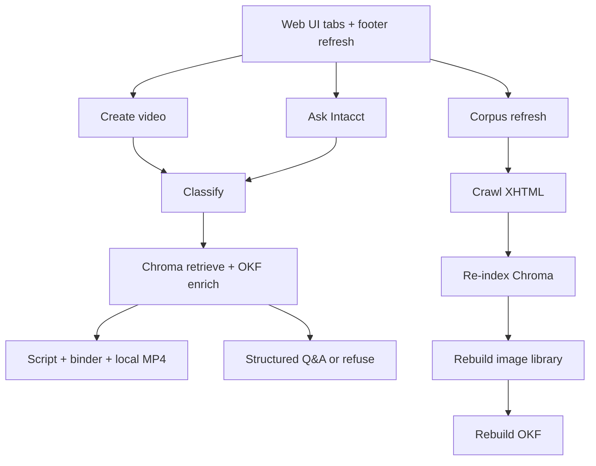

# SI VidGen — Intacct Knowledge Studio

Local-first prototype that helps **Sage Intacct** information developers and project managers:

1. **Create video** — turn a support issue into a grounded script and Help-faithful walkthrough MP4.
2. **Ask Intacct** — answer product-usage questions with multi-hop Help retrieval (no video).
3. **Refresh Help corpus** — re-scrape live Help and rebuild local Chroma, image library, and OKF assets.

Default video path preserves Help Center screenshots via a **local compositor** (Ken Burns + neural TTS + captions). Optional Higgsfield generation remains available but is secondary when UI fidelity matters.

---

## Goal

Build a **local-first prototype** that:

1. Accepts issues/questions via the **web UI** (two tabs + footer admin control).
2. Classifies with a **local LLM** (Ollama, models ≤ ~12B).
3. Retrieves authorized Intacct Help via **RAG** over Flare **XHTML** in **Chroma**, enriched by a parallel **OKF** concept bundle.
4. **Video tab:** generates a reviewable script, binds Help image-library screenshots, renders local MP4.
5. **Ask tab:** returns structured answers (summary → steps → notes) with live Help links; refuses when Help coverage is insufficient.
6. **Footer:** confirmed full corpus refresh (crawl → index → image library → OKF), blocking other LLM work while running.
7. Emits **structured JSON telemetry**, keeps thorough tests/docs, and stays GitHub-ready.

**Non-goals for V0:** multi-tenant SaaS, end-customer portals, live LMS publish, cloud LLM inference, Flare source (`.fl*`) ingest, inventing screenshots not in Help.

---

## Confirmed constraints

| Constraint | Decision |
|---|---|
| Runtime | Local Python **3.11+** venv |
| Hardware | RTX 4070–class; chat models **≤ ~12B** |
| LLM | Ollama — `gemma3:12b` primary, `llama3.2:latest` fallback, `nomic-embed-text` |
| Corpus | Published Flare XHTML under `/ia/docs/en_US/help_action/` |
| Knowledge layers | Chroma (retrieval) + OKF under `data/okf/` (parallel concepts) + `data/help_assets/` |
| Vector store | **Chroma** now → **Pinecone** later (`VectorStore` protocol) |
| Video default | `VIDEO_BACKEND=local_compositor` |
| Video optional | `VIDEO_BACKEND=higgsfield` |
| UI | React + Vite; FastAPI |
| Deploy desire | GitHub Actions; full cloud (Vercel + hosted API) later — no split UI/backend production |

---

## System flow



Shared **work gate** ensures video, ask, and refresh do not overlap on the local LLM.

---

## Local setup

```powershell
cd f:\SI_VidGen
py -3.11 -m venv .venv
.\.venv\Scripts\Activate.ps1
pip install -r requirements-dev.txt
Copy-Item .env.example .env
cd web; npm install; cd ..

python main.py          # API
# second terminal:
cd web; npm run dev     # http://localhost:5173
```

Corpus bootstrap:

```powershell
python -m src.rag.index_help --full
python -m src.rag.build_image_library
python -m src.rag.build_okf
```

Or use **Re-ingest Help** in the UI footer (lengthy; confirms before starting).

---

## Documentation map

| Doc | Purpose |
|---|---|
| `DEVELOPMENT_STATUS.md` | Living build status |
| `tasks.md` | Task checklist |
| `pitch_deck.md` | Stakeholder brief |
| `docs/architecture.md` | Runtime design |
| `docs/api.md` | HTTP contracts |
| `docs/operator_guide.md` | Info-dev / PM workflow |
| `docs/developer_guide.md` | Setup, index, verify |
| `docs/corpus_flare_xhtml.md` | Crawl / re-index |
| `docs/okf.md` | OKF parallel bundle |
| `docs/image_library.md` | Screenshot library |
| `docs/sample_query.md` | CSV-import demo |
| `docs/multilingual.md` | FR/DE/ES-ES (deferred) |
| `docs/telemetry.md` | Run events / privacy |

Obsolete early stubs and local probe artifacts live under gitignored `archive/`.

---

## Testing

```powershell
ruff check .
pytest --cov=src
cd web; npm run lint; npm run build
```

CI (GitHub Actions): lint + unit/integration/e2e without paid APIs.
