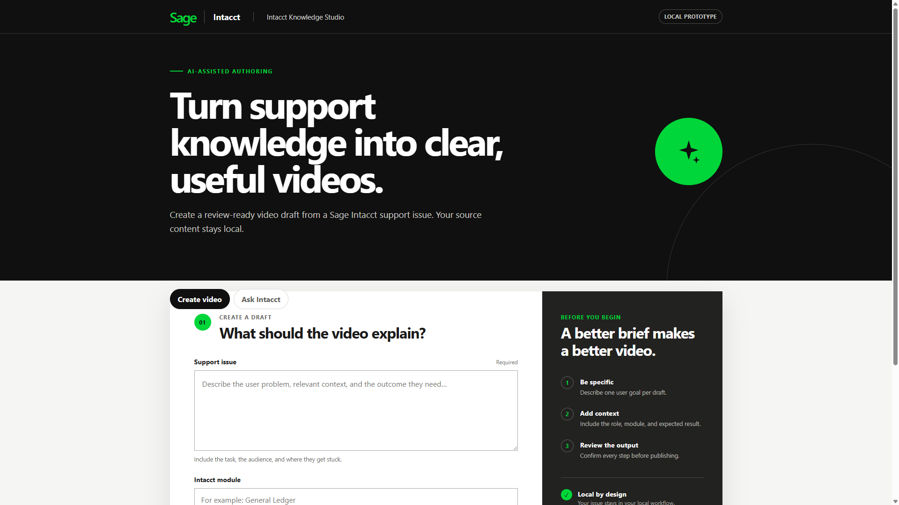
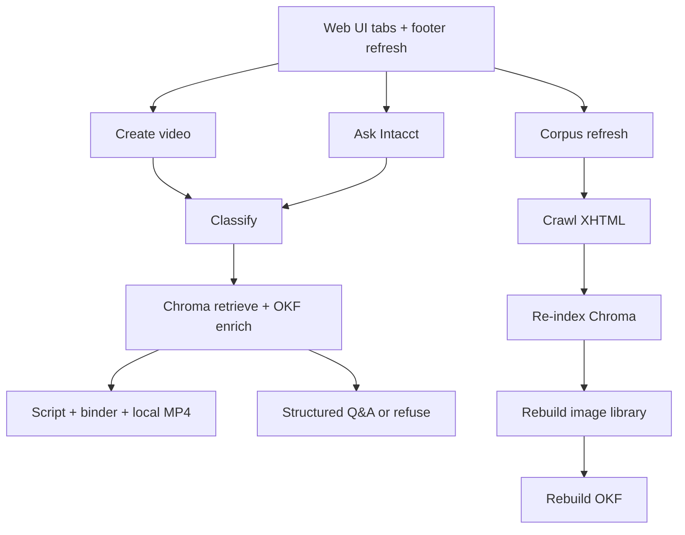

# SI VidGen — Intacct Knowledge Studio

Local-first prototype for **Sage Intacct** information developers, project managers, and internal staff.



| Tab / control | What it does |
|---|---|
| **Create video** | Support issue → grounded script → Help-faithful local MP4 |
| **Ask Intacct** | Product how-to answers from Help (multi-hop RAG; refuse if coverage is thin) |
| **Footer → Re-ingest Help** | Refresh local Help cache, Chroma index, image library, and OKF |

---

## Runs without commercial cloud AI tokens

The **default demo path is fully local**. Classification, embeddings, script/Q&A generation, and video composition do **not** call OpenAI, Anthropic, Google Gemini, Higgsfield, or other paid generative APIs.

| Capability | Default provider | Consumes commercial AI tokens? |
|---|---|---|
| Chat / classify / script / Ask | **Ollama** on your machine | **No** |
| Embeddings | **Ollama** `nomic-embed-text` | **No** |
| Vector search | **Chroma** on disk | **No** |
| Walkthrough video | **Local compositor** (Help PNGs + Edge TTS) | **No** |
| Help crawl / OKF / image library | Your disk + public Help URLs | **No** (HTTP fetch of authorized Help only) |

Optional `VIDEO_BACKEND=higgsfield` exists for experiments, but it is **not required** and is **off by default**. Leave it unset (or `local_compositor`) for shared testing with a collaborator.

You may still need normal network access to:

- `git clone` / `npm install` / `pip install`
- Crawl the authorized Intacct Help site when building or refreshing the corpus
- Edge neural TTS (Microsoft Edge online voices). If offline, the compositor falls back to local TTS.

None of those are generative “token” bills from a commercial LLM/video vendor.

---

## What you get

1. **Create video** — RAG over Flare-published Help XHTML (Chroma) + OKF enrichment → reviewable script → local MP4 that preserves Help screenshots.
2. **Ask Intacct** — multi-hop Help Q&A with structured **summary → steps → notes** and live Help links; refuses when evidence is weak (coverage diagnostic).
3. **Corpus refresh** — footer control re-scrapes Help and rebuilds Chroma, `help_assets`, and OKF (blocks other LLM work while running).

**Non-goals for V0:** multi-tenant SaaS, end-customer portals, live LMS publish, cloud LLM inference as the default, Flare authoring-source ingest, inventing UI screenshots.

---

## Run on another computer (collaborator setup)

Use a Windows machine with a recent GPU if possible (RTX 4070–class is the reference). CPU-only Ollama works for smoke tests but will be slow.

### 1. Prerequisites

| Tool | Notes |
|---|---|
| **Git** | Clone this repo |
| **Python 3.11+** | `py -3.11` on Windows |
| **Node.js 20+** | For the Vite UI (`npm`) |
| **[Ollama](https://ollama.com/)** | Local LLM runtime |
| **ffmpeg** | Usually pulled via `imageio-ffmpeg`; system ffmpeg also fine |

### 2. Clone and install

```powershell
git clone https://github.com/Ben408/SI-VidGen.git
cd SI-VidGen

py -3.11 -m venv .venv
.\.venv\Scripts\Activate.ps1
python -m pip install --upgrade pip
pip install -r requirements-dev.txt

cd web
npm install
cd ..

Copy-Item .env.example .env
```

Confirm `.env` keeps the local defaults:

- `VIDEO_BACKEND=local_compositor`
- `OLLAMA_BASE_URL=http://127.0.0.1:11434`
- Leave `HIGGSFIELD_API_KEY` empty

### 3. Pull Ollama models

**This app’s Ask / script / video chat model is still `gemma3:12b`.**  
`qwen2.5-hermes` is for **Hermes-Local** (Slack `/hermes` fallback), not for Knowledge Studio Ask/script unless you deliberately change `.env` and retest.

```powershell
# Prefer models on F: (shared with Hermes / Slack host)
$env:OLLAMA_MODELS = 'F:\OllamaModels'

ollama pull gemma3:12b
ollama pull llama3.2:latest
ollama pull nomic-embed-text
# Optional (Hermes free MT / agent — not required for UI Ask/video):
# ollama pull translategemma:12b
# ollama pull qwen2.5:14b
```

On a smaller machine you can temporarily point `.env` at `llama3.2:latest` as `OLLAMA_CHAT_MODEL` for faster (lower-quality) iteration.

### 4. Build local Help knowledge (first time)

Authorized English Help only (published XHTML). This downloads Help pages/images—not cloud LLM tokens.

```powershell
# Full crawl + index (lengthy; polite delay)
python -m src.rag.index_help --full

# Screenshot library for video binding
python -m src.rag.build_image_library

# Parallel OKF concepts (procedure / asset metadata)
python -m src.rag.build_okf
```

For a quick smoke test instead of the full corpus:

```powershell
python -m src.rag.index_help --max-pages 25
python -m src.rag.build_image_library --max-downloads 20
python -m src.rag.build_okf --max-pages 25
```

### 5. Start the app

**Option A — launcher**

```powershell
.\start-si-vidgen.bat
```

**Option B — two terminals**

```powershell
# Terminal 1 — API
.\.venv\Scripts\Activate.ps1
$env:PYTHONPATH = (Get-Location).Path
python main.py

# Terminal 2 — UI
cd web
npm run dev -- --host 127.0.0.1 --port 5173
```

Open **http://127.0.0.1:5173/**

### 6. Smoke-check together

1. **Create video** — paste the sample from [`docs/sample_query.md`](docs/sample_query.md); generate draft; confirm sources + local compositor path.
2. **Ask Intacct** — ask a how-to question; confirm steps + Help links (or a coverage refusal).
3. Do **not** turn on Higgsfield unless you intentionally want a cloud video experiment.

### Sharing notes for collaborators

- Runtime corpora (`data/help_xhtml/`, `data/help_assets/`, `data/okf/`, `data/vector_store/`) are **gitignored**—each machine builds its own (or copies a prebuilt data drop offline by agreement).
- Never commit `.env` or API keys.
- Prefer the same Ollama model names as `.env.example` so results are comparable.
- Corpus refresh from the UI footer is available to everyone in the prototype; it is lengthy and blocks video/Ask while running.

---

## System flow



A shared **work gate** keeps video, Ask, and refresh from overlapping on the local LLM.

---

## Documentation map

| Doc | Purpose |
|---|---|
| `DEVELOPMENT_STATUS.md` | Living build status |
| `tasks.md` | Task checklist |
| `pitch_deck.md` | Stakeholder brief |
| `docs/architecture.md` | Runtime design |
| `docs/api.md` | HTTP contracts |
| `docs/operator_guide.md` | Info-dev / PM workflow |
| `docs/developer_guide.md` | Setup detail |
| `docs/corpus_flare_xhtml.md` | Crawl / re-index |
| `docs/okf.md` | OKF parallel bundle |
| `docs/image_library.md` | Screenshot library |
| `docs/sample_query.md` | CSV-import demo |
| `docs/multilingual.md` | FR/DE/ES hybrid strategy (crawl in progress) |
| `docs/telemetry.md` | Run events / privacy |

Local scratch (probes, old outputs) lives under gitignored `archive/`.

---

## Sibling projects (local + GitHub)

| Repo | Role | Default models |
|---|---|---|
| **SI-VidGen** (this) | Ask / video / corpus engine + HTTP API | **`gemma3:12b`** + `nomic-embed-text` |
| **SI-VidGen-Slack** | Slack front door → VidGen API + Hermes | (none — routes only) |
| **Hermes-Local** | Termweb / Phrase / free translate skills | Dispatcher + `translategemma:12b`; chat fallback `qwen2.5-hermes` |

Slack tokens, Phrase/Termweb secrets, and Hermes allowlists live only in the Slack / Hermes repos. This repo stays free of Slack SDKs.

See `DEVELOPMENT_STATUS.md` for the RAG language-filter fix and T1 smoke notes.

---

## Verify

```powershell
ruff check .
pytest --cov=src
cd web
npm run lint
npm run build
```

CI (GitHub Actions) runs lint + tests **without** paid AI APIs.
